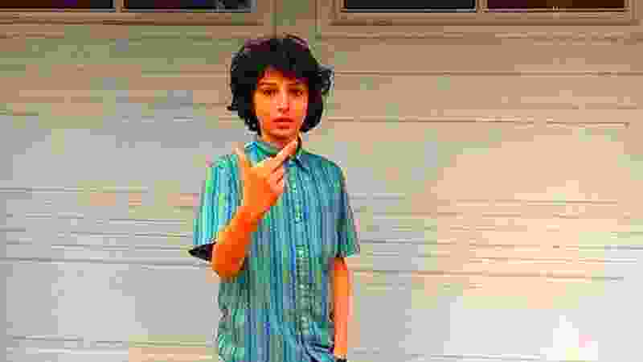

# NeedsMoreJPEG

Original            |  JPEG'ed
:-------------------------:|:-------------------------:
  |  

Original            |  JPEG'ed
:-------------------------:|:-------------------------:
  |  

You ever look at an image and think "this needs to be 1/10 the quality and 5 times more color saturated"?
